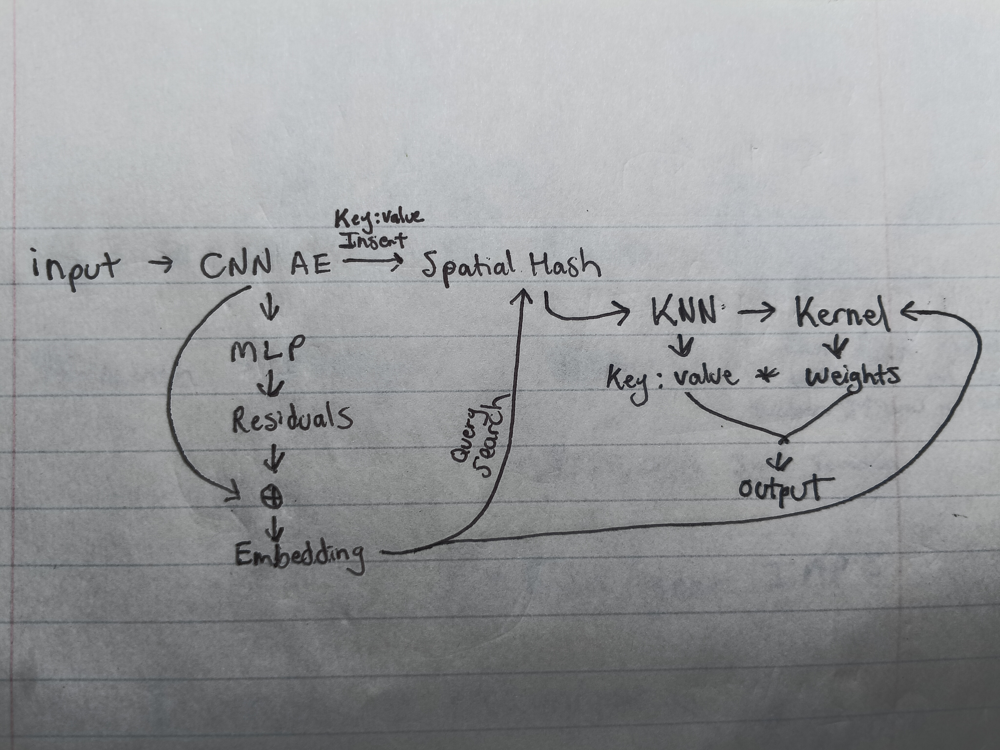
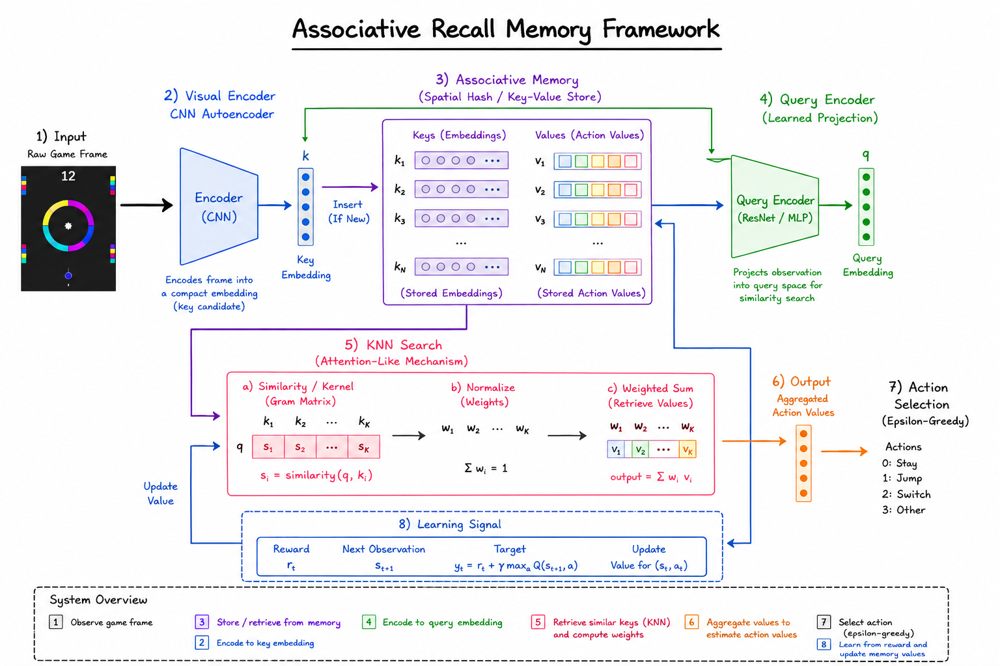

# Associative recall memory: a framework that contains a visual encoder, an attention mechanism, and memory retrieval!

## Backstory

You know, I never did give up on solving the Color Switch Machine Learning problems. Why was it that certain algorithms could successfully achieve mastery in so many games while not doing the same in Color Switch? This thought provokes me to research further. The research is thought provoking. It forms a positive feedback loop.

Take for example the paper “Playing Atari with Deep Reinforcement Learning”. Without thorough inspection, it’s easy to mistake the headlines for reality. The headlines focused heavily on the AI "teaching itself" to play from scratch, beating human experts, and paving the way toward Artificial General Intelligence.

Functionally speaking, I’d say it’s more comparable to say the LSTM’s learning subsets of obstacles in the game Color Switch – if it didn’t have to do for the fact that the Color Switch LSTM’s weren’t directly processing pixels. Arguably however, pixel data ultimately was considered. It was fed into a CNN auto encoder, followed by an LSTM. This resulted in higher performing, but similar behaving bots.

This shouldn’t have shocked me because even in the paper, super human performance wasn’t the standard being achieved here. This meant that certain games likely had bottlenecks that could not be passed. Their evaluations indicate that solutions couldn’t achieve human performance on some games, let alone get close on others. Yet my initial inspection, primarily focused on the headlines, gave me the impression (similarly to the flappy birds ai experiments online) that Color Switch should be a cake walk in terms of getting an AI to achieve mastery on.

When that wasn’t the case, and I noticed the error in my observations, I breathed a slight internal sigh of relief. Maybe I could give myself a little credit. After all, the sparse MoE solution could crank through a pretty high set of levels and achieve a pretty solid score on endless, plus generalize to additional modes. I also did get access to in game player data, and let me tell ya, the bot could outperform a percentage of humans.

That paper did maintain my attention for another reason as well. DQN’s success got me thinking about something along a simpler set of lines. Namely, Q Networks, and their potential ability to provide additional insight into this problem. Maybe I could scale the sparse MoE solution and see if that could out match human performance? I’d need to keep my experimentation to utilizing pixel data as input. I wanted to press onward with this. I also wanted to shift gears a bit, slow down and catch a cool breeze while I determined what to do moving forward.

You know what sounded more relaxing than implementing DQN’s or scaling the MoE? Q Networks. Gosh, I had been dying to implement a running solution of one, simply to observe its interaction with Color Switch.

I’d essentially reduced it down to a simple mental concept: quantized and searchable input space. A dictionary with key:value mappings from input observations to value estimations. Rather than using raycasts, I created a “pixel-like” input for experimentation. I conceptualized it as more of a manual convolution than anything else. I’d collision detect a grid around the player and encode a 1 for no hits and a 0 for any hits. This would create a black and white representation of the game, in a processable format, and quantized and searchable. The result of this was two-fold: I could use it for Q Networks, and I could use it for CNN’s. CNN’s being another option I wanted to thoroughly explore further. Motivated by the fact that I believed it could also be apart of the Atari paper’s success. No ablations I’d seen indicated otherwise. I mean just from a logical perspective, it seems that including a visual encoder in a machine learning algorithm, would greatly increase the performance of an image oriented computer vision problem. Duh right?

With the black and white image input of the game ready to use, and a spatial hash at the ready, I pressed forward once again. This time, ready to play! As Color Switch was played, the bot would receive the black and white image inputs of the game. As observations occurred in real time, they would be searched against the spatial hash. If the images aren’t present, they’re inserted in the spatial hash. If an observation is present, the value estimation for the actions the bot can take are output. Whether the best actions are selected or not, are determined by a greedy epsilon strategy. Sometimes the best action is chose, and sometimes random actions are. Whereby the ratio of this increases over time. Values are determined by which action leads to the longest future return.

So the bots interaction can be thought of as continually observing the environment, comparing it with past observation:action combinations, choosing the most similar ones, and then either maximizing its return, or trying new actions. This resulted in the de-facto standard for self learning from raw pixel data for bots. All jokes aside, it did result in a successful implementation of Q Networks. Albeit with a result whereby the learning algorithm wasn’t prohibitively slow, but it certainly wasn’t ideal. The fact that it wasn’t slow was remarkable in and of itself simply because its inputs were derived from pixel data. Naturally, the dimensionality reduction of the black and white image conversion was playing a major role in this.

My subsequent experiments included knowledge from behavioral cloning. The following results still give me the occasional goosebumps. It sort of reminds me of the first time I watched bots pass a level in Color Switch. I was startled. It might come off as anticlimactic. To quickly recap the experiment, I wrote some code to temporarily disable the bot from playing at the beginning of the game. While this was occurring, I’d simultaneously be playing in place of the bot. This inserted my game play into the Q Network’s systems. When the bots game play was re-enabled, it wasn’t starting from scratch anymore. This resulted in what I observed as the bot quite literally “learning to play in real time” instead of looking like painstaking trial and error. I’m not sure why but the experience gave me hope and scared me at the same time. It showed promise even in that stage. Partially out of confidence in my ability to reproduce the code, I literally just deleted it and moved on.

Now, the black and white image trick is something I’m fond of. Though behavioral cloning with a Q Network, maybe even in this manner, isn’t anything new. The speed, of the pixel to action learning, that was something that stood out as an oddity. After all, I had built and trained a lot of models and agents to play Color Switch. I had yet to see anything learn that fast. Ready to play some more?

Good. Because it doesn’t stop there. That approach, while foundational in its influence in my conceptualization of future design, was naive and trivial. So much so, that I had recognized it in advance, but only in one significant way. The fact that the black and white image trick substitutes as a “good enough” analogous output from a literal CNN auto encoder is evident of this. I always knew one would inevitably replace it, and it would be doing a similar process under the hood. However, the next advancement that makes the original approach foundational, but outdated, is a neural wrapper. You see, if Deep Q Networks could upgrade a Q Network with a neural interface, so could my approach. And this idea is the precursor to my next “startled moment”.

What if there was a hybrid approach that combined Q Networks and DQN’s? A sort of approach where an agent would look and see and remember memories that are associated with what they are seeing; but more specifically they learn better associations in real time via the neural wrapper. Those associations produce better actions. A sort of miniature cognitive framework emerged.

It didn’t emerge without additional insight however. You see, my attention was on something else now. The “attention is all you need” paper. I’d been learning how transformers worked under the hood and I had a pretty good grasp of it by this point. Furthermore, while the Q Network approach could be expanded with a visual encoder, and would immediately contain neural tech, it wasn’t the only thing that pulled on my own attention. Besides, the way I viewed it, the setup essentially contained a functionally speaking visual encoder all ready. Anyways, attention, metaphorically speaking - it seemed to be present in the existing setup. You know, if you think of a red car, you see a red car. Well I thought of attention, and I seen it.

You see, I was utilizing a spatial hash in my setup. The search function is sometimes called “Query” ie Search and Query are synonymous in this sense. The input observation is the query passed to the spatial hash. What the query is compared to are the Key’s. What gets returned are the Values. That setup makes more sense to me in terms of how a “database-ified” version of attention would function. It was conceptually very elegant in terms of mechanistic interpretability too. Yet, it lacks one obvious thing: KQV matrices!

A natural next question for me was: how can I get more acquainted with the attention mechanism? Well, the keys were manual but could be learned in this setup. A CNN visual encoder could handle that portion. I could’ve re-projected them here yes but I chose not to. Query anyone? What if key:values are present in the spatial hash, but all visual observations passed through both visual encoder, and a query encoder? Such that the spatial hash can be queried for similar data in an attention like manner? And such that the query encoder is a learned function. Importantly, a residual network that outputs good ole embeddings. Transforming the similarity of keys with one another by re-projecting them into query space. Values could have also been re-projected, but again, I chose not to. The output is the KNN search in the spatial hash between the query and the keys to produce a gram matrix kernel which is then normalized to produce weights which is then used to multiply against the retrieved values. All in all, this setup enables the visual encoder to handle one thing, and associative memory retrieval to be handled by yet another: attention!

The visual encoder places similar standalone images nearby one another on a latent manifold. The attention like mechanism learns meaningful projections that push dissimilar image:action pairs less nearby one another and similar image:action pairs closer. Which is done via the query encoding projections. Memory and attention yields associative memory recall of image:actions.

### Original Diagram (clearly the cooler image)

### New Diagram (AI assisted w simple errors. Photoshop fixes? I need to learn how)
There's no "switch option" in the game
No Values aren't "action values", they are action probabilities
Step 3 is retrieve only
Step 4 happens at the same time as step 2
Step 5 KNN between the single query and the top K keys

